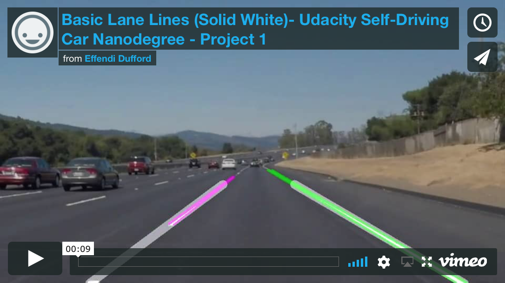
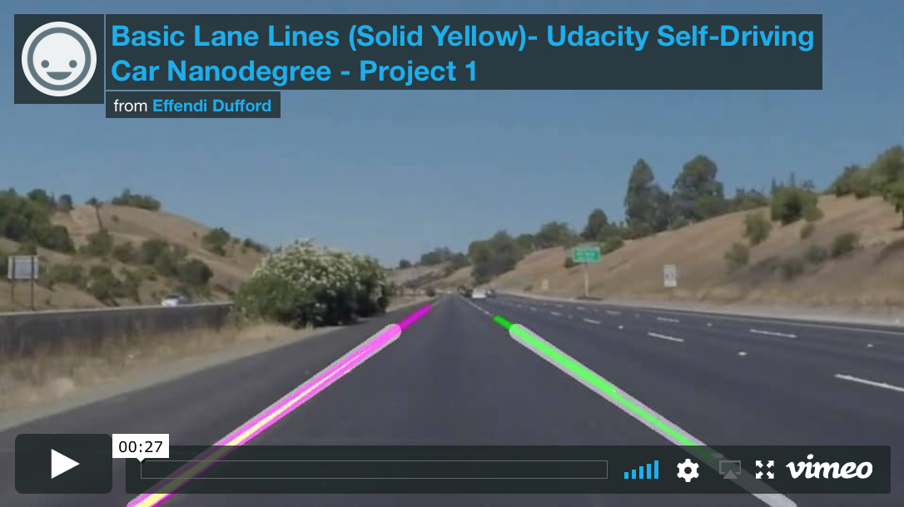
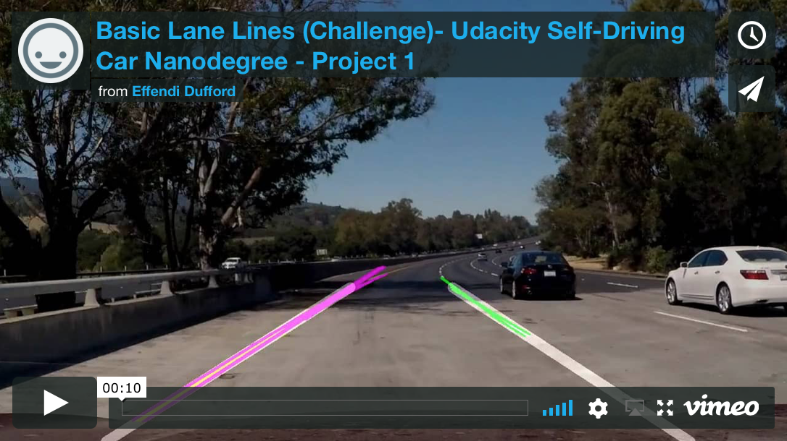

# **Finding Lane Lines on the Road**

**Udacity Self Driving Car Nanodegree - Project #1**

2017/6/1

## Overview

This project detects lane lines in images by applying color/region masks, Canny edge detection, Hough transform for determining lines, and setting the left/right lanes by a weighted linear polyfit.  The raw left/right lines and the final detected left/right lanes are overlaid on the original image as the output.

My **project results** are shown in the [project writeup](./P1_writeup.md) and the videos linked below.

White lane line video:

Yellow lane line video:

Optional challenge video:

## Files

| File 						|     Description	        											|
|:-------------------------:|:---------------------------------------------------------------------:|
| P1.ipynb 					| IPython notebook with all project code								|
| P1_final_code.py			| Python code extracted from notebook and reformatted as stand-alone	|
| P1_rawcode.py				| All raw Python code extracted from notebook							|
| [P1_writeup.md](./P1_writeup.md)				| The project writeup explaining the results							|
| /examples/				| Example images and videos included with original project assignment	|
| /test_images/				| Road images provided to test algorithm								|
| /test_images_output/		| Images generated by algorithm to show each step of pipeline			|
| /test_videos/				| Driving videos provided to test algorithm								|
| /test_videos_output/		| Driving videos generated by algorithm to show lane detection			|
| /writeup_screenshots/		| Images used in project writeup										|

The original Udacity project repository is [here](https://github.com/udacity/CarND-LaneLines-P1).

## How to Run Code

1. Set up [Udacity Self-Driving Car Term 1 Starter Kit](https://github.com/udacity/CarND-Term1-Starter-Kit) environment (Python 3)

2. Open the IPython notebook "P1.ipynb" using Jupyter, and execute all cells.
